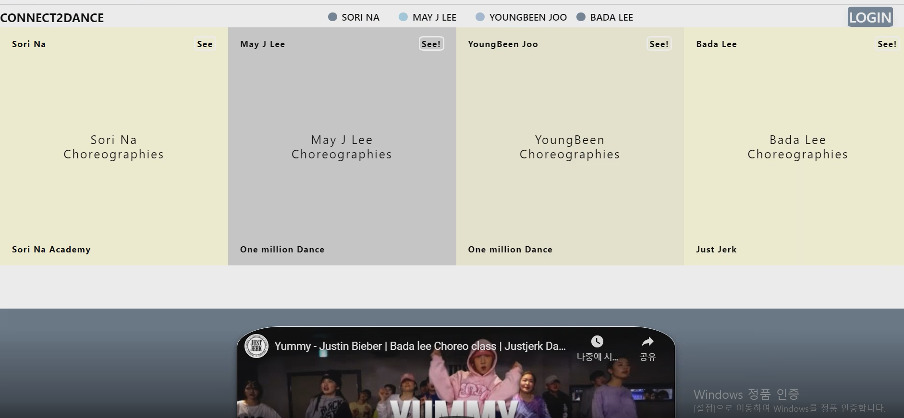
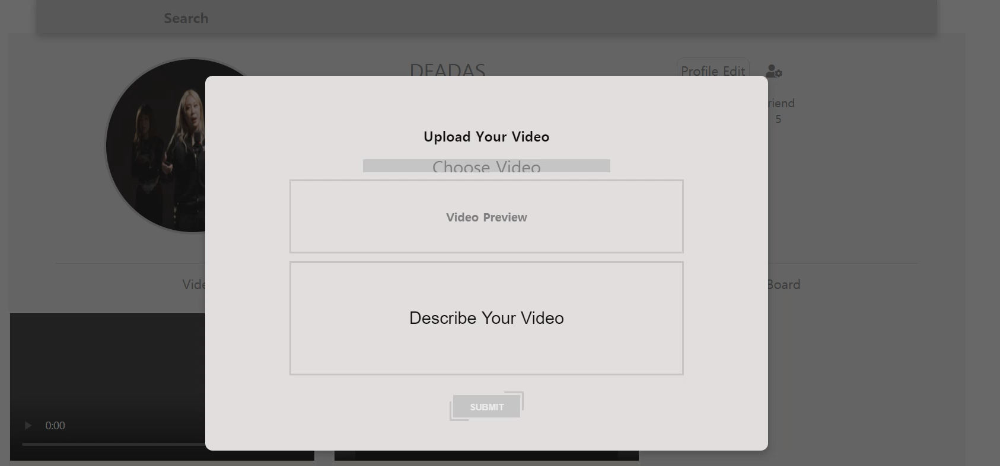
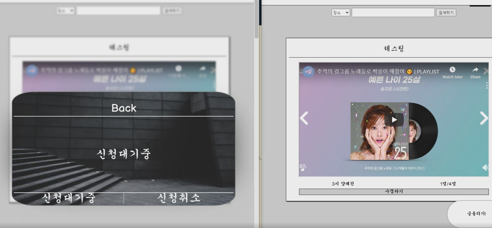
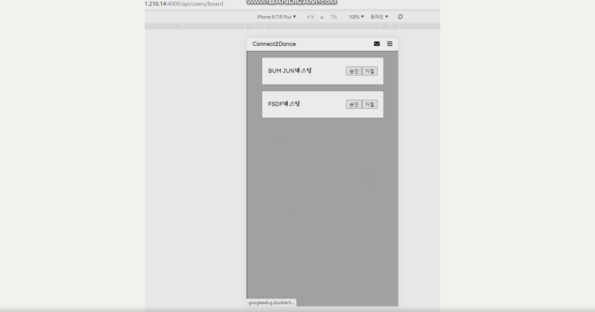
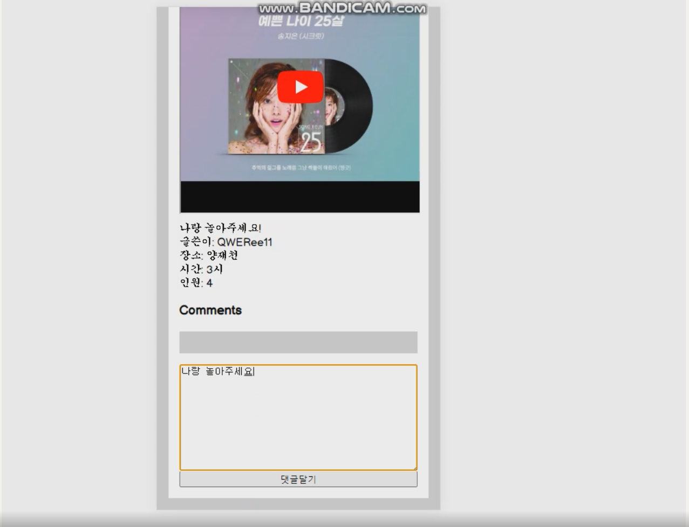
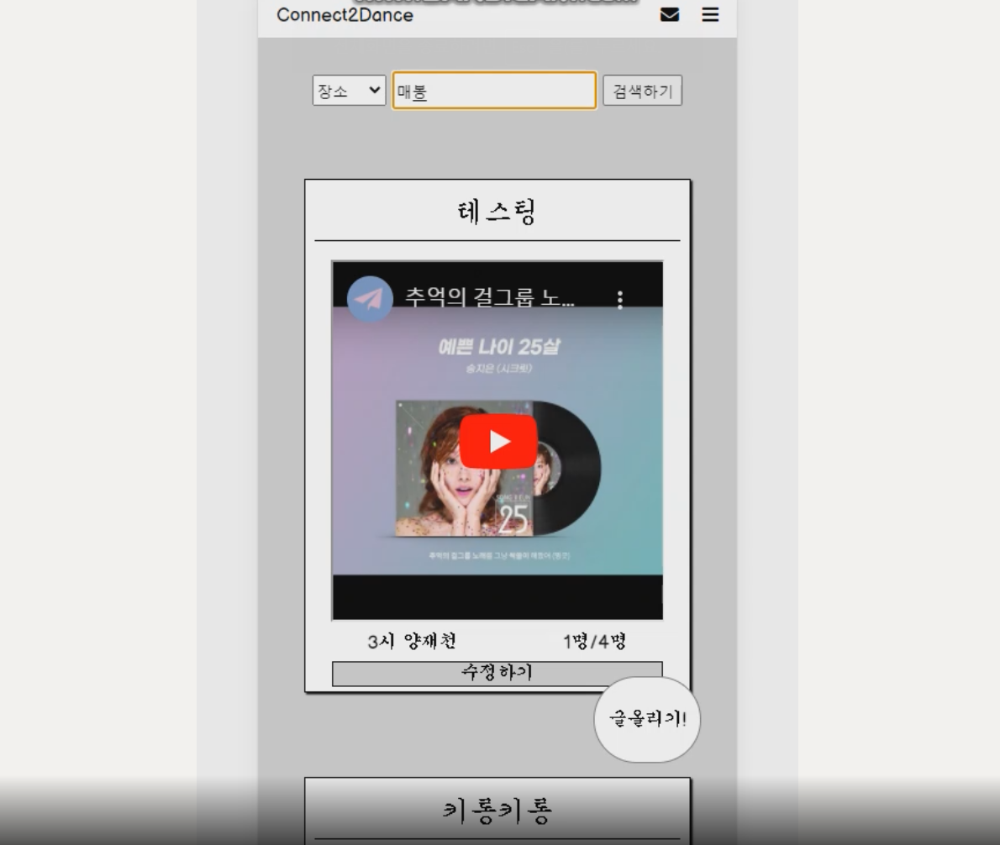
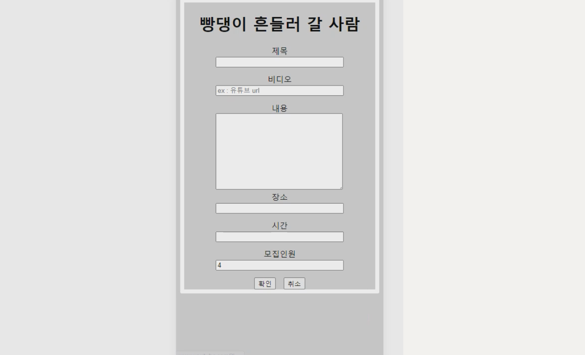

# Product Name
> Dancer, People Matching Platform

---

## Tech/framework used

1) Front-End
- EJS
- Javascript
- Sass
1) Back-End
- NodeJS
- MongoDB
- AWS storage 
- Socket.IO

---

## Product Introduction 

1) 안무가들 셀프 홍보 플랫폼 

안무가들 그리고, 춤을 배워하고 싶은 사람들을 대상으로 한 서비스
안무가들은, 자기만의 댄스 영상 및 필모를 업로드할 수 있고 자신이 제공할 수 있는 수업 목록 등을 올림으로써, 안무가들에게 자신을 pr 할 수 있는 공간을 마련해주고자 햇습니다.d

Service Targeted at Both Dancers and People who want to learn dancing
Dancers can self-advertise by uploading dance videos, philmography
Also they can upload lists of classes they can teach 

2) 원하는 춤 수업 및 서비스 소개 플랫폼 

춤을 좋아하는 사람들에게는,
자신이 원하는 장르의 , 자신이 원하는 시간대 및 선생님을 찾아서 바로 컨택트할 수 있는 
그러한 플랫폼을 만들고 싶었습니다.

For People, who love dancing , 
they can find the genre, time, teacher they want and
can directly contact them 

3) 춤을 취미로 하는 사람들 사이의 매칭 플랫폼 

뿐만 아니라, 춤을 좋아하는 사람들끼리
원하는 장소 및 시간에 모여서 같이 
춤을 즐길 수 있는 서비스도 제공하려 했습니다.

Additionally, Wanted to provide platform on which
people can enjoy and practice dancing at certain place or certain period of time 

---

## Product Description

 

### 1) MainPage

 
 

### 2) Authentication Page

JWT, Cookie Used

 
 

### 3) MySpace Page

MySpace 
- uploading videos to 'AWS_STORAGE'

 
 

### 4) Participate,Accept Page

Socket.IO

You can participate certain Dance Community ,

If you are the host, you can accept or deny
the request 

 
 

### 5) Comment Page

You can leave a comment to certain 
Post 

 
 

### 6) Search Page

You can search ceratin Posts

 
 

### 5) Post C.R.U.D

You can C,R,U,D 
your posts 

 
 

---

## Release History

* 0.0.1
    * Work in progress (React,Typescript,NodeJS,Scrapping)

---

## Meta

OH BUM JUN  – beomjun0638@hanmail.net

[https://github.com/ohbumjun/React_ChungHaBrocherSite](https://github.com/ohbumjun/React_ChungHaBrocherSite)

